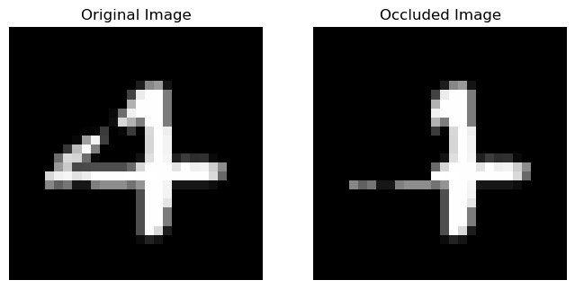
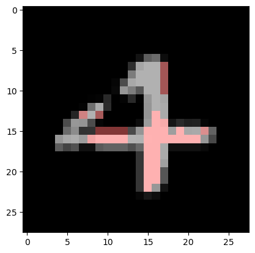
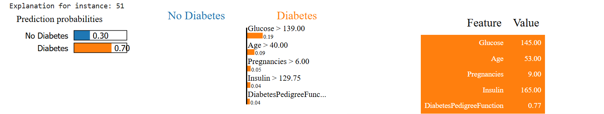

# Feature Attribution: Occlusion Technique and LIME

[](https://creativecommons.org/licenses/by/3.0/)
[](https://www.python.org/downloads/)

**License:** Creative Commons Attribution 3.0 Unported License  
**Based on:** [LIME Repository](https://github.com/marcotcr/lime)

## 📋 Overview

This project demonstrates two powerful **explainable AI (XAI)** techniques for understanding machine learning model predictions:

1. **Occlusion Technique** - A simple yet effective method for image attribution
2. **LIME (Local Interpretable Model-agnostic Explanations)** - Advanced local explanations for both image and tabular data

The exercises provide hands-on experience with interpreting model behavior on **MNIST digit classification** and **diabetes prediction** tasks.

## 🎯 Learning Objectives

- **Practice occlusion technique** on image data to identify important regions
- **Apply LIME** for both image and tabular data explanations
- **Compare different attribution methods** and their interpretability
- **Analyze model behavior** through feature importance visualization
- **Understand local vs global explanations** in machine learning

## 📊 Datasets Used

### 1. MNIST Dataset
- **70,000** handwritten digit images (0-9)
- **28×28** pixel grayscale images
- **Classification task:** Digit recognition
- **Model:** Multi-layer Perceptron (MLPClassifier)

### 2. Diabetes Dataset
- **768** patient records with medical measurements
- **8 features:** Glucose, BMI, Age, etc.
- **Classification task:** Diabetes prediction
- **Model:** Random Forest Classifier

## 🔧 Technical Implementation

### Image Classification Pipeline
```python
Pipeline([
    ('Make Gray', makegray_step),
    ('Flatten Image', flatten_step), 
    ('MLP', MLPClassifier(random_state=1, max_iter=300))
])
```

### Key Techniques Demonstrated

#### 1. Occlusion Technique
- **Method:** Systematically occlude image regions with black pixels
- **Analysis:** Observe prediction changes to identify important areas
- **Use case:** Understanding which parts of digits are crucial for classification

#### 2. LIME Image Explanation
- **Segmentation:** QuickShift algorithm for superpixel generation
- **Explanation:** Local linear approximation around the instance
- **Visualization:** Highlighted regions showing feature importance

#### 3. LIME Tabular Explanation
- **Feature perturbation** around the local neighborhood
- **Linear model fitting** to approximate black-box behavior
- **Feature ranking** for positive/negative predictions

## 📈 Results & Key Findings

### Model Performance
- **MNIST Accuracy:** 97.7% on test set
- **Effective digit discrimination** between similar numbers (e.g., 1 vs 7)

### Occlusion Analysis Results
- **Top-left region** of digit 7 is crucial for distinguishing from digit 1
- **Occluding important regions** changes predictions from 7 → 1
- **Cross-validation** across different images confirms region importance

### LIME vs Occlusion Comparison
- **LIME identifies** similar important regions as manual occlusion
- **More granular analysis** with superpixel-level explanations
- **Consistent results** between both attribution methods

### Diabetes Prediction Insights
- **Important features:** Glucose levels, BMI, Age
- **Feature interactions** revealed through local explanations
- **LIME explanations**: Instance-specific feature importance (top 5 features per prediction)
- **Instance-specific** vs global feature importance differences

## 🔍 Key Exercises & Tasks

### Basic Occlusion:
- Load MNIST dataset and train MLP classifier
- Apply occlusion to digit images
- **Analyze prediction changes** when important regions are hidden

### Systematic Occlusion Analysis:
- Test different occlusion positions and sizes
- **Compare results across similar digits** (1 vs 7, 4 vs 7)
- Validate findings with multiple test images

### LIME Image Explanation:
- Apply LIME to MNIST digit classification
- **Compare LIME results with manual occlusion** findings
- Visualize important superpixels for model decisions

### LIME Tabular Analysis:
- Apply LIME to diabetes prediction dataset using Random Forest Classifier
- Identify important features for positive/negative predictions
- Analyze local vs global feature importance
- Key implementation details:
    - Dataset: 768 patient records with 8 medical features
    - Model: Random Forest (max_depth=3) for diabetes prediction
    - LIME setup: Local explanations with top 5 features
    - Instance-level analysis for individual patient predictions

## 🎨 Visualization Examples

### Occlusion Results
- **Before/After images** showing occluded regions
- **Prediction confidence** changes with occlusion
- **Heatmaps** of important regions across multiple samples


- Prediction of original image: 4
- Prediction of occluded image: 7
- Ground truth: 4

### LIME Explanations
- **Superpixel highlighting** for image data
- **Feature importance bars** for tabular data
- **Interactive explanations** with confidence scores



### LIME Results - Instance 51
**Prediction**: 70% Diabetes Risk
Key Risk Factors:

- **Glucose** = 145 (>139) - Weight: 0.19 - Primary driver
- **Age** = 53 (>40) - Weight: 0.10 - Age-related risk
- **DiabetesPedigreeFunction** = 0.77 - Weight: 0.05 - Genetic factor
- **Pregnancies** = 9 (>6) - Weight: 0.04 - Pregnancy history
- **Insulin** = 165 (>129.75) - Weight: 0.04 - Insulin resistance



### Summary

- Glucose is the strongest predictor (highest weight)
- Multiple risk factors combine for high diabetes probability
- No protective features identified
- Results align with clinical diabetes indicators
## 📊 Interpretation Guidelines

### What Makes Results Meaningful?
1. **Consistency** across similar examples
2. **Intuitive explanations** that align with human understanding
3. **Robustness** to small perturbations
4. **Actionable insights** for model improvement

### Critical Analysis Questions
- Do the highlighted regions make intuitive sense?
- Are explanations consistent across similar instances?
- How do local explanations differ from global feature importance?
- What limitations do these attribution methods have?

## 🔮 Extensions & Future Work

### Potential Improvements
- **GradCAM comparison** with occlusion and LIME
- **SHAP integration** for additional attribution methods
- **Adversarial robustness** testing of explanations
- **User study validation** of explanation quality

### Advanced Applications
- **Medical imaging** interpretation
- **Financial prediction** explanations
- **Natural language processing** attribution
- **Time series** explanation techniques


## 📚 References & Resources

### Core Papers
- **LIME:** Ribeiro, M. T., Singh, S., & Guestrin, C. (2016). "Why should I trust you?" Explaining the predictions of any classifier.
- **Occlusion:** Zeiler, M. D., & Fergus, R. (2014). Visualizing and understanding convolutional networks.

### Documentation
- [LIME Documentation](https://lime-ml.readthedocs.io/)
- [Scikit-learn User Guide](https://scikit-learn.org/stable/user_guide.html)
- [Scikit-image Segmentation](https://scikit-image.org/docs/stable/api/skimage.segmentation.html)

## 📄 License

This project is licensed under the **Creative Commons Attribution 3.0 Unported License**. You are free to:
- **Share** — copy and redistribute the material
- **Adapt** — remix, transform, and build upon the material
- **Commercial use** — use the material for commercial purposes

See [LICENSE](https://creativecommons.org/licenses/by/3.0/) for details.

---

**Note:** This notebook emphasizes interpretation and critical analysis of results over pure implementation. The focus is on understanding when and why these attribution methods work, their limitations, and how they can provide insights into model behavior.